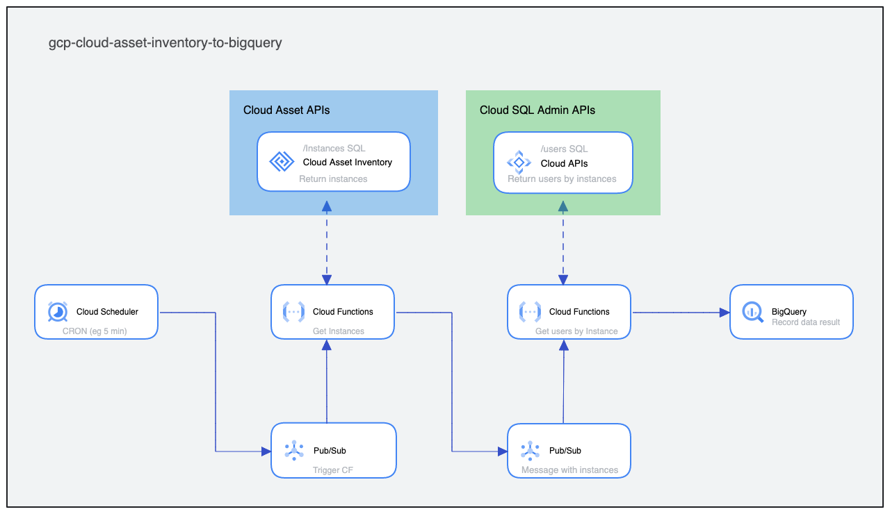
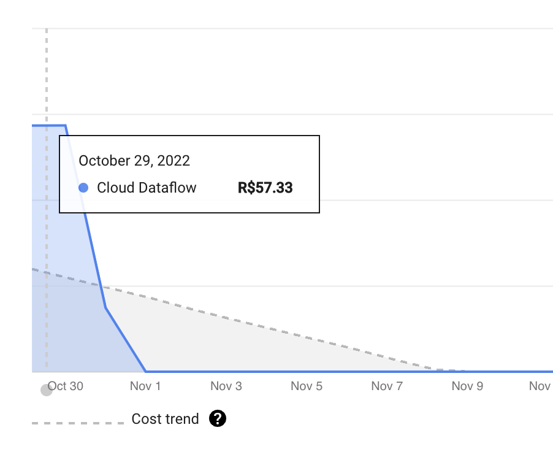
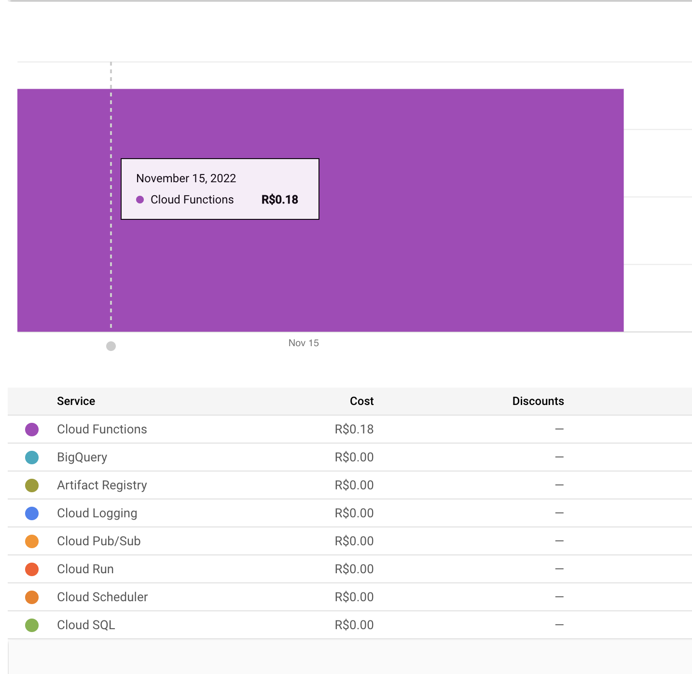

# gcp-cloud-asset-inventory-to-bigquery
Proof of Concept for to get data from Cloud Asset Inventory and send to BigQuery

<br /><br />

My purpose here is explore other approaches to export data from Cloud Asset API to BigQuery, using "Low-cost" components like Cloud Functions and Pub Sub, above i explain the other native options ["Motivations (And answers)"](#motivations-and-answers)

Has a medium coupling, because was designed to get all CloudSQL instances and their own active users;

## Diagram



## How it works

 - **Cloud Scheduler**: Will send a message to a pub/sub (with what type the kind to be used as message attribute, like *"["sqladmin.googleapis.com/Instance"]"*), with *PUSH* event, the Cloud Functions (get_cloudsql_instance_inventory), automatically will be triggered.

 - **Cloud Functions (get_cloudsql_instance_inventory)**: When occurs a "PUSH" type event from the pub/sub configured, will receive and decode a message, will get all existent instances by Cloud Asset API, will build a message (JSON) with founded instances and post to a pub/sub (1 message for instance founded) to be consumed by another function (put_cloudsql_users_to_bigquery).

 - **Cloud Functions (put_cloudsql_users_to_bigquery)**: When occurs a "PUSH" type event from the pub/sub configured, will receive and decode a message with founded instances, and will to get request to SQL Admin API searching for existent users for each instance in the message, the result will recorded into a BigQuery Table.

## Folder structure

- **[cloud_functions/*](cloud_functions)**: Contains the source code to run on Cloud Functions.

- **[cloud_functions_test/*](cloud_functions_test)**: Contains shell script to run functions on local environment (PyEnv, Functions-framework); to enable full functions (like request to Api, post a pubsub ), it's required to enable Auth Login [*Cloud SDK*](https://cloud.google.com/sdk/gcloud/reference/auth/application-default/login)

 - **[infra-as-code/*](infra-as-code)**: Contains the infrastructure as code to deploy onto Google Cloud using Terraform, see the docs [*here*](infra-as-code/terraform/README.md)
  
```
.
├── cloud_functions
│   ├── get_cloudsql_instance_inventory
│   │   ├── main.py
│   │   └── requirements.txt
│   └── put_cloudsql_users_to_bigquery
│       ├── main.py
│       └── requirements.txt
├── cloud_functions_test
│   ├── get_cloudsql_instance_inventory.sh
│   └── put_cloudsql_users_to_bigquery.sh
└── infra-as-code
    └── terraform
        ├── archive_file.tf
        ├── backend.tfvars
        ├── google_bigquery_dataset.tf
        ├── google_bigquery_dataset_iam_member.tf
        ├── google_bigquery_table.tf
        ├── google_client_config.tf
        ├── google_cloud_scheduler_job.tf
        ├── google_cloudfunctions2_function.tf
        ├── google_project.tf
        ├── google_project_iam_member.tf
        ├── google_pubsub_topic.tf
        ├── google_pubsub_topic_iam_member.tf
        ├── google_service_account.tf
        ├── google_storage_bucket.tf
        ├── google_storage_bucket_object.tf
        ├── main.tf
        ├── outputs.tf
        ├── provider.tfvars
        ├── random_string.tf
        └── variables.tf
```

## Requirements

- **To run Terraform in Automation**: you'll need a GCP Service Account (https://cloud.google.com/iam/docs/creating-managing-service-accounts) with permissions granted:

| Permission | Role |
|:-----------|------|
| BigQuery Admin | roles/bigquery.admin |
| Editor | roles/editor |
| Project IAM Admin | roles/resourcemanager.projectIamAdmin |
| Pub/Sub Admin | roles/pubsub.admin |

> **WARNING**: Be careful with Service Account Account Key, see how to manage it - https://cloud.google.com/iam/docs/creating-managing-service-account-keys, as soon will review this permissions, or grained it as security best practice, for now it's are permissions necessary to execute Terraform files.


## How to use

- To run as is, easiest way is to configure and run Terraform, below is detailed how to execute it.

## How to execute Terraform

### Configuring

With the Service Account created, the permissions (roles) associated and the exported the Account Keys to a safe local in your environment, follow the steps:

- **Create a local file (*.tfvars) for backend/provider settings**:

```provider.tfvars```
```
project          = "dummy-project"
region           = "us-central1"
credentials_file = "/user/gcp/service_account_key.json"
```

```backend.tfvars```
```
bucket      = "dummy-bucket"
prefix      = "terraform/state"
credentials = "/user/gcp/service_account_key.json"
```

### Running

#### Run Terraform with variable file

```Init```
```
terraform init -backend-config=backend.tfvars
```

```Plan```
```
terraform plan -var-file=provider.tfvars 
```

```Apply```
```
terraform apply -var-file=provider.tfvars 
```

#### Run Terraform on Github Actions

to use example workflow, see the files [*here*](.github/workflows/terraform.yaml)

it's necessary to configure this Actions Secrets with will use the builtin workflow in this repo:

```GCP_SERVICE_ACCOUNT```: Input the content from Account Key Json from Service Account (before, encode it to base64 format and record as Action Secret on Github);

```TERRAFORM_ACTION```: Input the action to guide Terraform **apply** ou **destroy** on workflow;

```TERRAFORM_BACKEND_TFVARS```:  Input the content the Backend configured as template showed above (before, encode it to base64 format and record as Action Secret on Github);

```TERRAFORM_PROVIDER_TFVARS```: Input the content the Provider configured as template showed above (before, encode it to base64 format and record as Action Secret on Github);

## Motivations (And answers)

How as i said, this is only a Proof of Concept, i've acknowledge there's other native easiest ways, but the cost is a factor to be considered before to adopted it, i'll explain below:

### Other approaches

There's the other approaches to execute the mechanism to export Data from Cloud Asset to BigQuery,  see below:

https://cloud.google.com/asset-inventory/docs/exporting-to-bigquery

https://cloud.google.com/dataflow/docs/tutorials/dataflow-stream-to-bigquery

But will be created a other resource as part to dependency for this task, called Dataflow (with Datapipeline), that's is abstracted as job to be executed on virtual machine (the price is according the capacity), if will don't estimating a large messages to process, is a factor to be consider:

Discussion: https://stackoverflow.com/questions/67869367/google-dataflow-pricing-streaming-mode

I've tested multiples models for some days, in costs comparison, the difference was significative, see below:

- Using Dataflow resources (1 full day enabled):



- Serverless resources (like Cloud Functions, pub/sub ...):



I accord with other benefits that the native way grants, but how as i said, i recommend to review the benefits x costs before to choose the right solution (like requires high throughput to process messages in short time)

I hope that my impressions helped who read until here :)

## References

https://cloud.google.com/asset-inventory/docs/reference/rest

https://cloud.google.com/sql/docs/mysql/admin-api

https://cloud.google.com/functions/docs/concepts/python-runtime

https://cloud.google.com/pubsub/docs/overview

https://cloud.google.com/functions/docs/calling/pubsub

https://cloud.google.com/bigquery/docs/schemas

https://cloud.google.com/scheduler/docs/creating